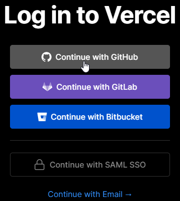

# Introduction

Hello ! You have made your next js application and now you probably want to deploy it so you can share it to your friends and family. 

One option is to deploy it on Vercel. Because there is a free option and it is pretty quick to understand. Let me show you how I do it 🚀.

# Deploying

## 1) Committing your code to Github

If not already done, commit your code and publish it on github. write .env in your gitignore, it’s to avoid publishing sensitive data such as API key passwords on github.

## 2) Make a Vercel account - sign up / log in

If you haven’t already, go to [https://vercel.com/login](https://vercel.com/login) and either log in, or sign up.

I suggest you login with your github account, because it will make everything easier and also normally you should generally put your projects on github in private or public.

your dashboard should look like this

## 3) Deploying the project

After clicking on “New Project” you should get something like this, you should be able to find all your Next.js projects. Then click on “import”

then hit deploy

! if you have API keys written in a .env file, you should write them under “Environment Variables” before hitting “Deploy” button.

# 😎 Conclusion

Congratulations ! You have successfully deployed your Next js web application to the internet 🌐. Now you can share your link to everybody you know ! In this tutorial, I showed the process that I used to deploy 😀.