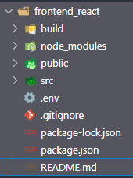
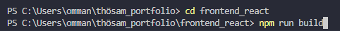
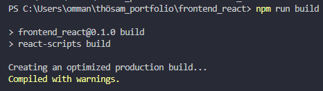
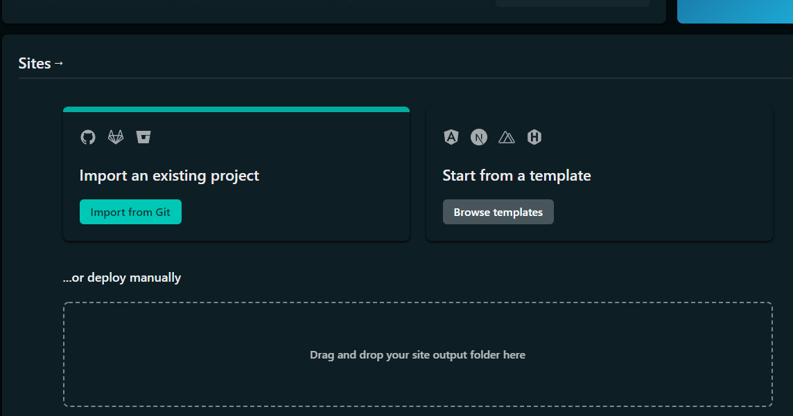
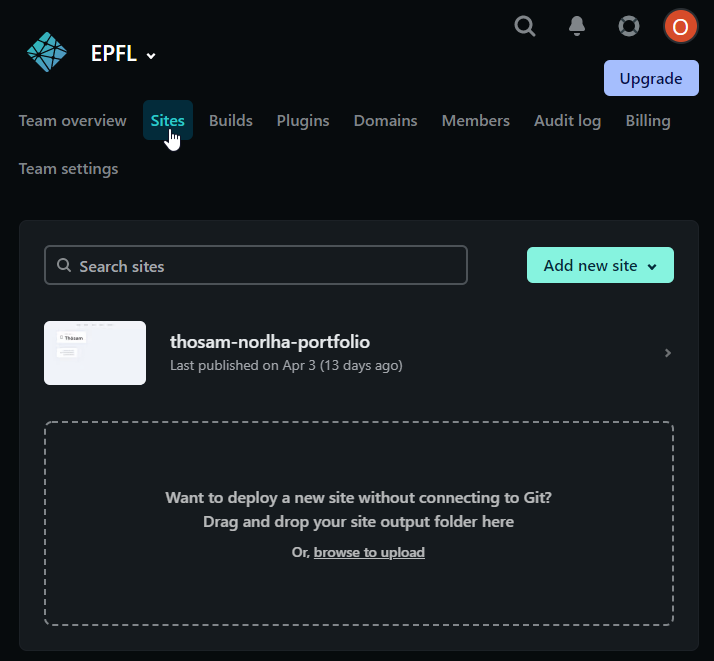
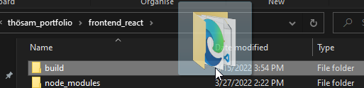
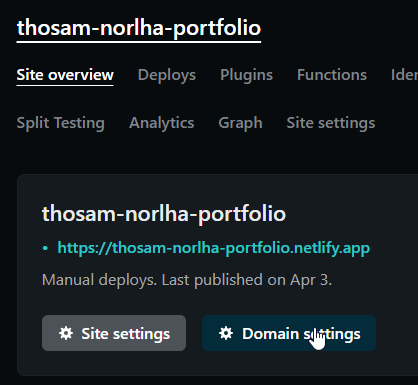
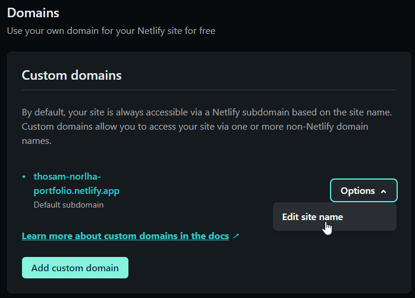

# Introduction

Hello ! You have made your react application and now you probably want to deploy it so you can share it to your friends and family 🙂.

One option is to deploy it on Netlify. Because there is a free option and it is pretty quick to understand. Let me show you how I do it 🚀.

# Deploying

make netlify account

## 1) Make a netlify account - sign up / log in

If you haven’t already, go to [https://netlify.app/](https://netlify.app/) and either log in, or sign up.

## 2) npm run build / yarn run build

If your code editor is not open, open it with your project in it.

And then run the command : npm run build (or yarn run build if you have yarn as your package manager)

make sure that you are in the correct folder (the folder that contains all of those files (if build folder is not here, it’s okay, this is what we will create now)): 

I am on VS code and it should look like this : 

This command will build and optimize your react application ready for production. The output should look like this :

If the command worked, you should see the new build folder

## 3) Deploy

Go back to Netlify and, under “sites” section. It should look like this : 

- If it is your first time :

- if you already have a site there :

In either case, drag and drop you “build” folder from step 2 into this big rectangle. ! if you are on vscode you may need to drag and drop from your file explorer :

## 4) Bonus - change your site name

Go to domain settings (first select your website if you have many)

Scroll down until you see

Now you can change it into something nicer and don’t forget to save !

# 😎 Conclusion

Congratulations ! You have successfully deployed your react web application to the internet 🌐. Now you can share your link to everybody you know ! In this tutorial it was this link : [https://thosam-norlha-portfolio.netlify.app/](https://thosam-norlha-portfolio.netlify.app/)